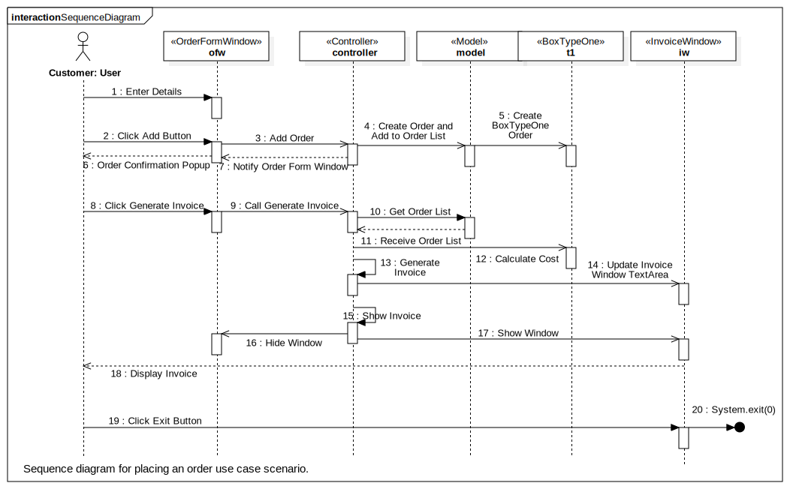
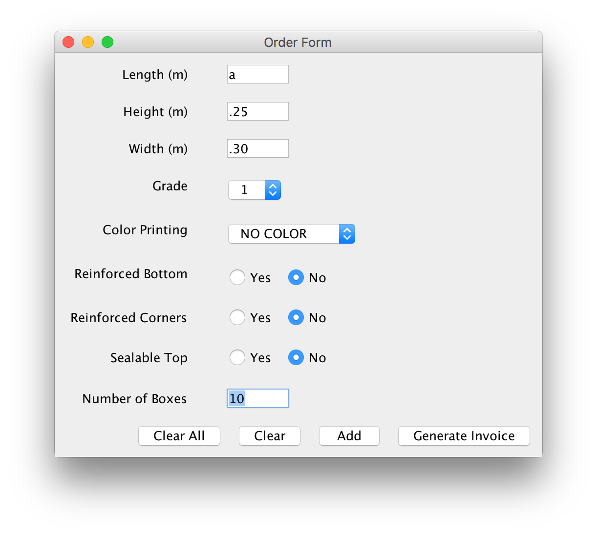

# FlexBox App
## Description
The application lets the user input the details of the cardboard box order(s) and generate an invoice. If the order cannot be supplied by the company, order is rejected with an error message.
#### Assumptions
If the user supplies multiple orders and one of the order is not valid or has invalid inputs, the order is not added to the list of orders. If the user decides to proceedi, an invoice for the remaining orders (if any) is generated.
#### Limitations
Invoice is generated in plain text and there is no built-in print or download options. Generated invoices are not saved in application and once the user decide to place a new order, the current order details are reset.  
All error and info messages are pop-ups.
## Class Hierarchy Diagram

## Instance Diagram

## Use Case Diagram

## Test Schedule
#### **Test 1**
-----------------
###### Scenerio
Invalid input(s)
###### Input
Length: a  
Height: .25  
Width: .30  
Number of Boxes: 10  
###### Expected Output
A popup showing error message "Invalid input: Please check the values"
###### Screenshots
</br></br>
</br></br>
#### **Test 2**
----------------
###### Scenerio
Incorrect input
###### Input
Length: 0.20  
Height: 0.30  
Widht: 0.25  
Number of Boxes: 0  
###### Expected Output
A popup showing error message "Invalid input: Box dimensions and count must be greater than 0"
###### Screenshots
</br>
</br>
#### **Test 3**
----------------
###### Scenerio
Non-suppliable order
###### Input
Length: .10  
Height: .20  
Width: .40  
Grade: 4  
Reinforced Bottom: Yes  
Number of Boxes: 10  
###### Expected Output
A popup showing error message "Sorry, we are not able to supply this order"
###### Screenshots
</br>
</br>
#### **Test 4**
----------------
###### Scenerio
Generate invoice for empty order list
###### Input
Click 'Generate Invoice' button without adding any orders.
###### Expected Output
A popup showing error message "Please add your order before generating the invoice"
###### Screenshots
</br>
</br>
#### **Test 5**
----------------
###### Scenerio
Single Order invoice
###### Input
Length: 0.20  
Height: 0.30  
Widht: 0.25  
Grade: 3  
Color Printing: TWO COLORS  
Reinforced Bottom: Yes  
Reinforced Corner: Yes  
Sealable Top: No  
Number of Boxes: 10  
###### Expected Output
A popup showing info message "Order added successfully"  
Invoice for the order.
###### Screenshots
</br>
</br>
</br>
#### **Test 6**
----------------
###### Scenerio
Multiple orders in same invoice
###### Input
Order 1  
Length: 0.20  
Height: 0.30  
Widht: 0.25  
Grade: 3  
Color Printing: TWO COLORS  
Reinforced Bottom: Yes  
Reinforced Corner: No  
Sealable Top: No  
Number of Boxes: 15  

Order 2  
Length: 0.25  
Height: 0.30  
Widht: 0.15  
Grade: 5  
Color Printing: TWO COLORS  
Reinforced Bottom: Yes  
Reinforced Corner: Yes  
Sealable Top: No  
Number of Boxes: 10  

Order 3  
Length: 0.20  
Height: 0.30  
Widht: 0.25  
Grade: 1  
Color Printing: NO COLORS  
Reinforced Bottom: No  
Reinforced Corner: No  
Sealable Top: Yes  
Number of Boxes: 20  
###### Expected Output
A "Order added successfully" popup for each oder.  
Single invoice for all the three orders.
###### Screenshots
</br>
</br>
</br>


## Sample Inputs and Outputs
#### **1**
-----------
###### Input
```
Length: 0.25
Height: 0.30
Width: 0.20
Grade: 2
Color Printing: ONE COLOR
Reinforcement Bottom: No
Reinforcement Corners: No
Sealable Top: Yes
Number of Boxes: 10
```
###### Output
```
Invoice

Order 1
Length: 0.25m
Width: 0.20m
Height: 0.30m
Grade of Card: 2
Color print: No Color
Reinforced Bottom: No
Reinforced Corners: No
Sealable Tops: Yes
Number of Boxes: 10
Cost: $2.40

Total payable: $2.40
```
#### **2**
-----------
###### Input
```
Length: 0.20
Height: 0.30
Width: 0.40
Grade: 4
Color Printing: TWO COLORS
Reinforcement Bottom: Yes
Reinforcement Corners: No
Sealable Top: No
Number of Boxes: 15
```
###### Output
```
Invoice

Order 1
Length: 0.20m
Width: 0.40m
Height: 0.30m
Grade of Card: 4
Color print: Two Colors
Reinforced Bottom: Yes
Reinforced Corners: No
Sealable Tops: No
Number of Boxes: 15
Cost: $9.13

Total payable: $9.13
```
#### **3**
-----------
###### Input
```
Length: 0.15
Height: 0.20
Width: 0.10
Grade: 1
Color Printing: ONE COLOR
Reinforcement Bottom: No
Reinforcement Corners: No
Sealable Top: Yes
Number of Boxes: 15

Length: 0.25
Height: 0.25
Width: 0.40
Grade: 4
Color Printing: TWO COLORS
Reinforcement Bottom: Yes
Reinforcement Corners: Yes
Sealable Top: No
Number of Boxes: 25
```
###### Output
```
Invoice

Order 1
Length: 0.15m
Width: 0.10m
Height: 0.20m
Grade of Card: 1
Color print: No Color
Reinforced Bottom: No
Reinforced Corners: No
Sealable Tops: Yes
Number of Boxes: 15
Cost: $1.05

Order 2
Length: 0.25m
Width: 0.40m
Height: 0.25m
Grade of Card: 4
Color print: Two Colors
Reinforced Bottom: Yes
Reinforced Corners: Yes
Sealable Tops: No
Number of Boxes: 25
Cost: $16.54

Total payable: $17.59
```
## Appendix
#### FlexBox.java
```java
package flexbox;

public class FlexBox {

    public static void main(String[] args) {
        new Controller();
    }
}
```
#### InvalidInputException.java
```java
package flexbox;

/*
Thrown when
 - there is no matching type of box for the user input
 - the user input is invalid or wrong
 - generating invoice on empty oder list
 */
public class InvalidInputException extends Exception {
    public InvalidInputException(String message) {
        super(message);
    }
}
```
#### View.java
```java
package flexbox;

import javax.swing.JFrame;

public abstract class View extends JFrame {

    protected Controller controller;

    public View(String title) {
        super(title);
        initComponents();
    }

    // Method to connect view to the controller
    public void setController(Controller c) {
        this.controller = c;
    }

    /*
    The following steps needs to be done in initComponents abstract method.
        Set GUI Layout
        instantiate GUI components and other instance variables
        add GUI components to the content pane
    */
    abstract void initComponents();
}
```
#### OrderFormWindow.java
```java
package flexbox;

import javax.swing.*;
import java.awt.event.*;
import static flexbox.Controller.PRINTING_OPTIONS;

public class OrderFormWindow extends View {

    private JButton addButton;
    private JButton clearAllButton;
    private JButton clearButton;
    private JComboBox<String> colorPrintingComboBox;
    private JLabel colorPrintingLabel;
    private JLabel countLabel;
    private JTextField countTextField;
    private JButton genInvoiceButton;
    private JComboBox<String> gradeComboBox;
    private JLabel gradeLabel;
    private JLabel heightLabel;
    private JTextField heightTextField;
    private JLabel lengthLabel;
    private JTextField lengthTextField;
    private JLabel widthLabel;
    private JTextField widthTextField;
    private ButtonGroup reBottomGroup;
    private JLabel reBottomLabel;
    private JRadioButton reBottomNoRadioButton;
    private JRadioButton reBottomYesRadioButton;
    private ButtonGroup reCornerGroup;
    private JLabel reCornerLabel;
    private JRadioButton reCornerNoRadioButton;
    private JRadioButton reCornerYesRadioButton;
    private ButtonGroup sealableTopGroup;
    private JLabel sealableTopLabel;
    private JRadioButton sealableTopNoRadioButton;
    private JRadioButton sealableTopYesRadioButton;
    private final String alertTitle = "FlexBox";

    public OrderFormWindow() {
        super("Order Form");
    }

    @SuppressWarnings("unchecked")
    void initComponents() {
        /* Instantiate components */

        // Labels
        //
        lengthLabel = new JLabel("Length (m)");
        heightLabel = new JLabel("Height (m)");
        widthLabel = new JLabel("Width (m)");
        gradeLabel = new JLabel("Grade");
        colorPrintingLabel = new JLabel("Color Printing");
        reBottomLabel = new JLabel("Reinforced Bottom");
        reCornerLabel = new JLabel("Reinforced Corners");
        sealableTopLabel = new JLabel("Sealable Top");
        countLabel = new JLabel("Number of Boxes");

        // TextFields initialized with 5 columns
        //
        lengthTextField = new JTextField(5);
        heightTextField = new JTextField(5);
        widthTextField = new JTextField(5);
        countTextField = new JTextField(5);

        // Combo boxes
        //
        gradeComboBox = new JComboBox<>();
        gradeComboBox.setModel(new DefaultComboBoxModel<>(new String[]{"1", "2", "3", "4", "5"}));

        colorPrintingComboBox = new JComboBox<>();
        colorPrintingComboBox.setModel(new DefaultComboBoxModel<>(new String[]{"NO COLOR", "ONE COLOR", "TWO COLORS"}));

        // Radio Buttons
        // Initialize radio buttons with a default selection of "No"
        //
        reBottomYesRadioButton = new JRadioButton("Yes", false);
        reBottomNoRadioButton = new JRadioButton("No", true);
        reCornerYesRadioButton = new JRadioButton("Yes", false);
        reCornerNoRadioButton = new JRadioButton("No", true);
        sealableTopYesRadioButton = new JRadioButton("Yes", false);
        sealableTopNoRadioButton = new JRadioButton("No", true);

        // Group the radio buttons
        //
        reBottomGroup = new ButtonGroup();
        reBottomGroup.add(reBottomYesRadioButton);
        reBottomGroup.add(reBottomNoRadioButton);

        reCornerGroup = new ButtonGroup();
        reCornerGroup.add(reCornerYesRadioButton);
        reCornerGroup.add(reCornerNoRadioButton);

        sealableTopGroup = new ButtonGroup();
        sealableTopGroup.add(sealableTopYesRadioButton);
        sealableTopGroup.add(sealableTopNoRadioButton);

        // Buttons
        //
        addButton = new JButton("Add");
        addButton.addActionListener(new ActionListener() {
            public void actionPerformed(ActionEvent evt) {
                addButtonActionPerformed(evt);
            }
        });

        clearButton = new JButton("Clear");
        clearButton.addActionListener(new ActionListener() {
            public void actionPerformed(ActionEvent evt) {
                clearButtonActionPerformed(evt);
            }
        });

        clearAllButton = new JButton("Clear All");
        clearAllButton.addActionListener(new ActionListener() {
            public void actionPerformed(ActionEvent evt) {
                clearAllButtonActionPerformed(evt);
            }
        });

        genInvoiceButton = new JButton("Generate Invoice");
        genInvoiceButton.addActionListener(new ActionListener() {
            public void actionPerformed(ActionEvent evt) {
                genInvoiceButtonActionPerformed(evt);
            }
        });

        // Create content pane and set layout
        GroupLayout layout = new GroupLayout(getContentPane());
        getContentPane().setLayout(layout);
        setDefaultCloseOperation(WindowConstants.EXIT_ON_CLOSE);
        layout.setHorizontalGroup(
                layout.createParallelGroup(GroupLayout.Alignment.LEADING)
                        .addGroup(layout.createSequentialGroup()
                                .addGap(16, 16, 16)
                                .addGroup(layout.createParallelGroup(GroupLayout.Alignment.TRAILING)
                                        .addComponent(sealableTopLabel)
                                        .addComponent(reCornerLabel)
                                        .addComponent(reBottomLabel)
                                        .addComponent(colorPrintingLabel)
                                        .addComponent(gradeLabel)
                                        .addComponent(widthLabel)
                                        .addComponent(heightLabel)
                                        .addComponent(lengthLabel)
                                        .addComponent(countLabel))
                                .addGap(37, 37, 37)
                                .addGroup(layout.createParallelGroup(GroupLayout.Alignment.LEADING)
                                        .addComponent(lengthTextField, GroupLayout.PREFERRED_SIZE, GroupLayout.DEFAULT_SIZE, GroupLayout.PREFERRED_SIZE)
                                        .addComponent(heightTextField, GroupLayout.PREFERRED_SIZE, GroupLayout.DEFAULT_SIZE, GroupLayout.PREFERRED_SIZE)
                                        .addComponent(widthTextField, GroupLayout.PREFERRED_SIZE, GroupLayout.DEFAULT_SIZE, GroupLayout.PREFERRED_SIZE)
                                        .addComponent(gradeComboBox, GroupLayout.PREFERRED_SIZE, GroupLayout.DEFAULT_SIZE, GroupLayout.PREFERRED_SIZE)
                                        .addComponent(colorPrintingComboBox, GroupLayout.PREFERRED_SIZE, GroupLayout.DEFAULT_SIZE, GroupLayout.PREFERRED_SIZE)
                                        .addGroup(layout.createSequentialGroup()
                                                .addComponent(reBottomYesRadioButton)
                                                .addPreferredGap(javax.swing.LayoutStyle.ComponentPlacement.RELATED)
                                                .addComponent(reBottomNoRadioButton))
                                        .addGroup(layout.createSequentialGroup()
                                                .addComponent(reCornerYesRadioButton)
                                                .addPreferredGap(javax.swing.LayoutStyle.ComponentPlacement.RELATED)
                                                .addComponent(reCornerNoRadioButton))
                                        .addGroup(layout.createSequentialGroup()
                                                .addComponent(sealableTopYesRadioButton)
                                                .addPreferredGap(javax.swing.LayoutStyle.ComponentPlacement.RELATED)
                                                .addComponent(sealableTopNoRadioButton))
                                        .addComponent(countTextField, GroupLayout.PREFERRED_SIZE, GroupLayout.DEFAULT_SIZE, GroupLayout.PREFERRED_SIZE))
                                .addContainerGap(GroupLayout.DEFAULT_SIZE, Short.MAX_VALUE))
                        .addGroup(GroupLayout.Alignment.TRAILING, layout.createSequentialGroup()
                                .addContainerGap(79, Short.MAX_VALUE)
                                .addComponent(clearAllButton)
                                .addPreferredGap(javax.swing.LayoutStyle.ComponentPlacement.RELATED)
                                .addComponent(clearButton)
                                .addPreferredGap(javax.swing.LayoutStyle.ComponentPlacement.RELATED)
                                .addComponent(addButton)
                                .addPreferredGap(javax.swing.LayoutStyle.ComponentPlacement.RELATED)
                                .addComponent(genInvoiceButton)
                                .addContainerGap())
        );
        layout.setVerticalGroup(
                layout.createParallelGroup(GroupLayout.Alignment.LEADING)
                        .addGroup(layout.createSequentialGroup()
                                .addGap(9, 9, 9)
                                .addGroup(layout.createParallelGroup(GroupLayout.Alignment.BASELINE)
                                        .addComponent(lengthLabel)
                                        .addComponent(lengthTextField, GroupLayout.PREFERRED_SIZE, GroupLayout.DEFAULT_SIZE, GroupLayout.PREFERRED_SIZE))
                                .addPreferredGap(javax.swing.LayoutStyle.ComponentPlacement.UNRELATED)
                                .addGroup(layout.createParallelGroup(GroupLayout.Alignment.BASELINE)
                                        .addComponent(heightLabel)
                                        .addComponent(heightTextField, GroupLayout.PREFERRED_SIZE, GroupLayout.DEFAULT_SIZE, GroupLayout.PREFERRED_SIZE))
                                .addGap(12, 12, 12)
                                .addGroup(layout.createParallelGroup(GroupLayout.Alignment.BASELINE)
                                        .addComponent(widthTextField, GroupLayout.PREFERRED_SIZE, GroupLayout.DEFAULT_SIZE, GroupLayout.PREFERRED_SIZE)
                                        .addComponent(widthLabel))
                                .addGap(17, 17, 17)
                                .addGroup(layout.createParallelGroup(GroupLayout.Alignment.LEADING)
                                        .addComponent(gradeLabel)
                                        .addComponent(gradeComboBox, GroupLayout.PREFERRED_SIZE, GroupLayout.DEFAULT_SIZE, GroupLayout.PREFERRED_SIZE))
                                .addGap(18, 18, 18)
                                .addGroup(layout.createParallelGroup(GroupLayout.Alignment.LEADING)
                                        .addComponent(colorPrintingLabel)
                                        .addComponent(colorPrintingComboBox, GroupLayout.PREFERRED_SIZE, GroupLayout.DEFAULT_SIZE, GroupLayout.PREFERRED_SIZE))
                                .addGap(18, 18, 18)
                                .addGroup(layout.createParallelGroup(GroupLayout.Alignment.LEADING)
                                        .addComponent(reBottomLabel)
                                        .addGroup(layout.createParallelGroup(GroupLayout.Alignment.BASELINE)
                                                .addComponent(reBottomYesRadioButton)
                                                .addComponent(reBottomNoRadioButton)))
                                .addGap(18, 18, 18)
                                .addGroup(layout.createParallelGroup(GroupLayout.Alignment.BASELINE)
                                        .addComponent(reCornerLabel)
                                        .addComponent(reCornerYesRadioButton)
                                        .addComponent(reCornerNoRadioButton))
                                .addGap(18, 18, 18)
                                .addGroup(layout.createParallelGroup(GroupLayout.Alignment.BASELINE)
                                        .addComponent(sealableTopLabel)
                                        .addComponent(sealableTopYesRadioButton)
                                        .addComponent(sealableTopNoRadioButton))
                                .addGap(18, 18, 18)
                                .addGroup(layout.createParallelGroup(GroupLayout.Alignment.BASELINE)
                                        .addComponent(countLabel)
                                        .addComponent(countTextField, GroupLayout.PREFERRED_SIZE, GroupLayout.DEFAULT_SIZE, GroupLayout.PREFERRED_SIZE))
                                .addPreferredGap(javax.swing.LayoutStyle.ComponentPlacement.UNRELATED)
                                .addGroup(layout.createParallelGroup(GroupLayout.Alignment.BASELINE)
                                        .addComponent(genInvoiceButton)
                                        .addComponent(addButton)
                                        .addComponent(clearButton)
                                        .addComponent(clearAllButton))
                                .addContainerGap(GroupLayout.DEFAULT_SIZE, Short.MAX_VALUE))
        );

        pack();
    }

    private void clearAllButtonActionPerformed(ActionEvent evt) {
        // Clear current form
        clearCurrentForm();

        // Clear the order details array
        controller.removeAllOrders();
    }

    private void clearButtonActionPerformed(ActionEvent evt) {
        // Clear all the text fields and radio button selections
        clearCurrentForm();
    }

    private void clearCurrentForm() {
        /*
        /  Reset all the text fields to empty
        /  Reset all the Radio buttons to default
        /  Reset combo boxes to default value
        */
        lengthTextField.setText("");
        widthTextField.setText("");
        heightTextField.setText("");
        countTextField.setText("");
        gradeComboBox.setSelectedIndex(0);
        colorPrintingComboBox.setSelectedIndex(0);
        reBottomNoRadioButton.setSelected(true);
        reBottomYesRadioButton.setSelected(false);
        reCornerNoRadioButton.setSelected(true);
        reCornerYesRadioButton.setSelected(false);
        sealableTopNoRadioButton.setSelected(true);
        sealableTopYesRadioButton.setSelected(false);
    }

    private void addButtonActionPerformed(ActionEvent evt) {
        captureFormDataAndUpdateController();
    }

    private void sendFormDataToController(final double length, final double height, final double width,
                                          final String grade, final PRINTING_OPTIONS cp, final boolean st,
                                          final boolean rb, final boolean rc, Integer num) {
        // Send form data to Controller
        try {
            controller.addOrder(length, height, width, grade, cp, st, rb, rc, num);
            clearCurrentForm();
            showOrderConfirmation();
        } catch (InvalidInputException e) {
            handleInvalidInput(e.getMessage());
        }
    }

    private void captureFormDataAndUpdateController() {

        // Capture the form data
        boolean valid = true;
        double height = 0.0;
        double length = 0.0;
        double width = 0.0;
        int num = 0;

        try {
            height = Double.parseDouble(heightTextField.getText());
            length = Double.parseDouble(lengthTextField.getText());
            width = Double.parseDouble(widthTextField.getText());
            num = Integer.parseInt(countTextField.getText());

            if ((num <= 0) || (height <= 0.0) || (length <= 0.0) || (width <= 0.0)) {
                throw new InvalidInputException("Invalid input: Box dimensions and count must be greater than 0");
            }
        } catch (NumberFormatException e) {
            valid = false;
            handleInvalidInput("Invalid input: Please check the values.");
        }
        catch (InvalidInputException e) {
            valid = false;
            handleInvalidInput(e.getMessage());
        }

        // Proceed with sending data to controller only if input data is valid
        if (valid) {
            String grade = (String) gradeComboBox.getSelectedItem();

            PRINTING_OPTIONS cp;
            switch ((String) colorPrintingComboBox.getSelectedItem()) {
                case "NO COLOR":
                    cp = PRINTING_OPTIONS.NO;
                    break;
                case "ONE COlOR":
                    cp = PRINTING_OPTIONS.ONE;
                    break;
                case "TWO COLORS":
                    cp = PRINTING_OPTIONS.TWO;
                    break;
                default:
                    cp = PRINTING_OPTIONS.NO;
                    break;
            }

            boolean st = sealableTopYesRadioButton.isSelected();

            boolean rb = reBottomYesRadioButton.isSelected();

            boolean rc = reCornerYesRadioButton.isSelected();

            sendFormDataToController(length, height, width, grade, cp, st, rb, rc, num);
        }
    }

    private void genInvoiceButtonActionPerformed(ActionEvent evt) {

        try {
            // Ask Controller to generate invoice and show the invoice window
            controller.generateInvoice();

            // Clear the form
            clearCurrentForm();
        }
        catch (InvalidInputException e) {
            handleInvalidInput(e.getMessage());
        }
    }

    private void handleInvalidInput(String message) {
        // Pop the error message up
        JOptionPane.showMessageDialog(this, message, alertTitle, JOptionPane.WARNING_MESSAGE);
    }

    private void showOrderConfirmation() {
        // Show an order added successfully popup
        String message = "Order added successfully";
        JOptionPane.showMessageDialog(this, message, alertTitle, JOptionPane.INFORMATION_MESSAGE);
    }
}
```
#### InvoiceWindow.java
```java
package flexbox;

import javax.swing.*;
import java.awt.event.*;

public class InvoiceWindow extends View {

    private JButton exitButton;
    private JTextArea invoiceSummaryTextArea;
    private JScrollPane invoiceScrollPane;
    private JButton newOrderButton;

    public InvoiceWindow() {
        super("Invoice");
    }

    @SuppressWarnings("unchecked")
    void initComponents() {

        /* Instantiate Components */

        // Scroll Pane
        invoiceScrollPane = new JScrollPane();

        // Text Area
        invoiceSummaryTextArea = new JTextArea(5,20);
        invoiceSummaryTextArea.setEditable(false);
        invoiceScrollPane.setViewportView(invoiceSummaryTextArea);

        // Buttons
        //
        exitButton = new JButton("Exit");
        exitButton.addActionListener(new ActionListener() {
            public void actionPerformed(ActionEvent evt) {
                exitButtonActionPerformed(evt);
            }
        });

        newOrderButton = new JButton("New Order");
        newOrderButton.addActionListener(new ActionListener() {
            public void actionPerformed(ActionEvent evt) {
                newOrderButtonActionPerformed(evt);
            }
        });

        // Create content pane and set layout
        GroupLayout layout = new GroupLayout(getContentPane());
        getContentPane().setLayout(layout);
        setDefaultCloseOperation(WindowConstants.EXIT_ON_CLOSE);
        layout.setHorizontalGroup(
                layout.createParallelGroup(GroupLayout.Alignment.LEADING)
                        .addGroup(layout.createSequentialGroup()
                                .addContainerGap()
                                .addGroup(layout.createParallelGroup(GroupLayout.Alignment.LEADING)
                                        .addComponent(invoiceScrollPane, GroupLayout.DEFAULT_SIZE, 487, Short.MAX_VALUE)
                                        .addGroup(GroupLayout.Alignment.TRAILING, layout.createSequentialGroup()
                                                .addGap(0, 0, Short.MAX_VALUE)
                                                .addComponent(newOrderButton)
                                                .addPreferredGap(LayoutStyle.ComponentPlacement.RELATED)
                                                .addComponent(exitButton)))
                                .addContainerGap())
        );
        layout.setVerticalGroup(
                layout.createParallelGroup(GroupLayout.Alignment.LEADING)
                        .addGroup(layout.createSequentialGroup()
                                .addContainerGap()
                                .addComponent(invoiceScrollPane, GroupLayout.PREFERRED_SIZE, 358, GroupLayout.PREFERRED_SIZE)
                                .addPreferredGap(LayoutStyle.ComponentPlacement.UNRELATED)
                                .addGroup(layout.createParallelGroup(GroupLayout.Alignment.BASELINE)
                                        .addComponent(exitButton)
                                        .addComponent(newOrderButton))
                                .addContainerGap(9, Short.MAX_VALUE))
        );

        pack();
    }

    private void exitButtonActionPerformed(ActionEvent evt) {
        System.exit(0);
    }

    private void newOrderButtonActionPerformed(ActionEvent evt) {
        controller.resetEverything();
    }

    public void setInvoiceTextArea(final String invoice) {
        invoiceSummaryTextArea.setText(invoice);
    }
}
```
#### Model.java
```java
package flexbox;

import java.util.ArrayList;

public class Model {

    private ArrayList<OrderDetails> orders;

    public Model() {
        orders = new ArrayList<>();
    }

    // add new order to the list
    public void addOrder(OrderDetails order) {
        orders.add(order);
    }

    // return orders array
    public ArrayList getOrderArray() {
        return orders;
    }

    // remove all orders added so far
    public void resetOrderArray() {
        orders.clear();
    }
}
```
#### OrderDetails.java
```java
package flexbox;

public abstract class OrderDetails {

    protected double height;
    protected double width;
    protected double length;
    protected String grade;
    protected Controller.PRINTING_OPTIONS colorPrinting;
    protected Boolean reBottom;
    protected Boolean reCorners;
    protected Boolean sealableTop;
    protected Integer count;
    protected double cost;

    public OrderDetails(final double height, final double width, final double length, final String grade,
                        final Controller.PRINTING_OPTIONS printing,
                        final Boolean bottom, final Boolean corners, final Boolean top, final int num) {
       this.height = height;
       this.width = width;
       this.length = length;
       this.grade = grade;
       this.colorPrinting = printing;
       this.reBottom = bottom;
       this.reCorners = corners;
       this.sealableTop = top;
       this.count = num;
    }

    protected double surfaceArea() {
        return ((2.0*length*width) + (2.0*length*height) + (2.0*height*width));
    }

    private String generateOrderSummary() {

        StringBuilder summary = new StringBuilder();
        summary.append(String.format("Length: %.2fm\n", length));
        summary.append(String.format("Width: %.2fm\n", width));
        summary.append(String.format("Height: %.2fm\n", height));
        summary.append(String.format("Grade of Card: %s\n", grade));
        summary.append("Color print: ");
        switch (colorPrinting) {
            case NO:
                summary.append("No Color\n");
            break;
            case ONE:
                summary.append("One Color\n");
            break;
            case TWO:
                summary.append("Two Colors\n");
            break;
        }
        summary.append("Reinforced Bottom: " + (reBottom? "Yes" : "No"));
        summary.append("\n");
        summary.append("Reinforced Corners: " + (reCorners? "Yes" : "No"));
        summary.append("\n");
        summary.append("Sealable Tops: " + (sealableTop? "Yes" : "No"));
        summary.append("\n");
        summary.append(String.format("Number of Boxes: %d\n", count));
        summary.append(String.format("Cost: $%.2f\n", cost));
        return summary.toString();
    }

    @Override
    public String toString() {
        return generateOrderSummary();
    }

    // Calculate cost including extras depending on box type
    abstract void calculateCost();
}
```
#### BoxTypeOne.java
```java
package flexbox;

import static flexbox.Controller.extraSealable;

public class BoxTypeOne extends OrderDetails {

    public BoxTypeOne(final double height, final double width, final double length, final String grade,
                      final Controller.PRINTING_OPTIONS printing,
                      final Boolean bottom, final Boolean corners, final Boolean top, final int num) {
        super(height, width, length, grade, printing, bottom, corners, top, num);
    }

    public void calculateCost() {
        double totalCost;
        double totalArea = surfaceArea();
        double baseCost = totalArea * Controller.cardCost.get(grade);

        // Apply sealable top pricing if applicable
        if (sealableTop) {
            totalCost = baseCost + (baseCost * extraSealable);
        } else {
            totalCost = baseCost;
        }

        cost = totalCost * count;
    }
}
```
#### BoxTypeTwo.java
```java
package flexbox;

import static flexbox.Controller.extraOneColorPrinting;
import static flexbox.Controller.extraSealable;

public class BoxTypeTwo extends OrderDetails {

    public BoxTypeTwo(final double height, final double width, final double length, final String grade,
                      final Controller.PRINTING_OPTIONS printing,
                      final Boolean bottom, final Boolean corners, final Boolean top, final int num) {
        super(height, width, length, grade, printing, bottom, corners, top, num);
    }

    public void calculateCost() {
        double totalCost;
        double totalArea = surfaceArea();
        double baseCost = totalArea * Controller.cardCost.get(grade);

        // Apply sealable top pricing if applicable
        if (sealableTop) {
            totalCost = baseCost + (baseCost * extraSealable);
        } else {
            totalCost = baseCost;
        }

        // Apply extra for one color printing
        totalCost += (baseCost * extraOneColorPrinting);

        cost = totalCost * count;
    }
}
```
#### BoxTypeThree.java
```java
package flexbox;

import static flexbox.Controller.extraSealable;
import static flexbox.Controller.extraTwoColorPrinting;

public class BoxTypeThree extends OrderDetails {

    public BoxTypeThree(final double height, final double width, final double length, final String grade,
                      final Controller.PRINTING_OPTIONS printing,
                      final Boolean bottom, final Boolean corners, final Boolean top, final int num) {
        super(height, width, length, grade, printing, bottom, corners, top, num);
    }

    public void calculateCost() {
        double totalCost;
        double totalArea = surfaceArea();
        double baseCost = totalArea * Controller.cardCost.get(grade);

        // Apply sealable top pricing if applicable
        if (sealableTop) {
            totalCost = baseCost + (baseCost * extraSealable);
        } else {
            totalCost = baseCost;
        }

        // Apply extra for two color printing
        totalCost += (baseCost * extraTwoColorPrinting);

        cost = totalCost * count;
    }
}
```
#### BoxTypeFour.java
```java
package flexbox;

import static flexbox.Controller.extraSealable;
import static flexbox.Controller.extraTwoColorPrinting;
import static flexbox.Controller.extraReBottom;

public class BoxTypeFour extends OrderDetails {

    public BoxTypeFour(final double height, final double width, final double length, final String grade,
                       final Controller.PRINTING_OPTIONS printing,
                       final Boolean bottom, final Boolean corners, final Boolean top, final int num) {
        super(height, width, length, grade, printing, bottom, corners, top, num);
    }

    public void calculateCost() {
        double totalCost;
        double totalArea = this.surfaceArea();
        double baseCost = totalArea * Controller.cardCost.get(this.grade);

        // Apply sealable top pricing if applicable
        if (sealableTop) {
            totalCost = baseCost + (baseCost * extraSealable);
        } else {
            totalCost = baseCost;
        }

        // Apply extra for two color printing
        totalCost += (baseCost * extraTwoColorPrinting);

        // Apply extra for reinforced bottom
        totalCost += (baseCost * extraReBottom);

        cost = totalCost * count;
    }
}
```
#### BoxTypeFive.java
```java
package flexbox;

import static flexbox.Controller.extraSealable;
import static flexbox.Controller.extraTwoColorPrinting;
import static flexbox.Controller.extraReBottom;

public class BoxTypeFour extends OrderDetails {

    public BoxTypeFour(final double height, final double width, final double length, final String grade,
                       final Controller.PRINTING_OPTIONS printing,
                       final Boolean bottom, final Boolean corners, final Boolean top, final int num) {
        super(height, width, length, grade, printing, bottom, corners, top, num);
    }

    public void calculateCost() {
        double totalCost;
        double totalArea = this.surfaceArea();
        double baseCost = totalArea * Controller.cardCost.get(this.grade);

        // Apply sealable top pricing if applicable
        if (sealableTop) {
            totalCost = baseCost + (baseCost * extraSealable);
        } else {
            totalCost = baseCost;
        }

        // Apply extra for two color printing
        totalCost += (baseCost * extraTwoColorPrinting);

        // Apply extra for reinforced bottom
        totalCost += (baseCost * extraReBottom);

        cost = totalCost * count;
    }
}
```
#### Controller.java
```java
package flexbox;

import java.util.*;

public class Controller {

    /* BEGIN app wide constant value declarations */
    public enum PRINTING_OPTIONS {
        NO,
        ONE,
        TWO
    }

    private enum BOX_TYPE {
        ONE,
        TWO,
        THREE,
        FOUR,
        FIVE,
        INVALID
    }

    public static HashMap<String, Double> cardCost = new HashMap<>();
    static {
        cardCost.put("1",0.50);
        cardCost.put("2",0.60);
        cardCost.put("3",0.72);
        cardCost.put("4",0.90);
        cardCost.put("5",1.40);
    }

    public static final double extraSealable = 0.08;
    public static final double extraOneColorPrinting = 0.13;
    public static final double extraTwoColorPrinting = 0.16;
    public static final double extraReBottom = 0.14;
    public static final double extraReCorners = 0.10;
    /* END */

    private OrderFormWindow ofw;
    private InvoiceWindow iw;
    private Model model;

    public Controller() {
        initializeApp();
    }

    private void initializeApp() {
        //Create the View objects
        ofw = new OrderFormWindow();
        iw = new InvoiceWindow();
        model = new Model();

        // Connect View objects with self
        ofw.setController(this);
        iw.setController(this);

        // Start both the windows and show only the OrderFormWindow
        // OrderFormWindow
        java.awt.EventQueue.invokeLater(new Runnable() {
            public void run() {
                ofw.setVisible(true);
            }
        });

        //InvoiceWindow
        java.awt.EventQueue.invokeLater(new Runnable() {
            public void run() {
                iw.setVisible(false);
            }
        });
    }

    private BOX_TYPE findBoxType(final double length, final double height, final double width,
                                 final String grade, final PRINTING_OPTIONS cp, final boolean st,
                                 final boolean rb, final boolean rc) {
        // Convert grade to integer for comparison
        Integer intGrade = Integer.parseInt(grade);

        if ((1 <= intGrade && intGrade <= 3) && cp == PRINTING_OPTIONS.NO && !rb && !rc) {
            return BOX_TYPE.ONE;
        } else if ((1 <= intGrade && intGrade <= 4) && cp == PRINTING_OPTIONS.ONE && !rb && !rc) {
            return BOX_TYPE.TWO;
        } else if ((2 <= intGrade && intGrade <= 5) && cp == PRINTING_OPTIONS.TWO && !rb && !rc) {
            return BOX_TYPE.THREE;
        } else if ((2 <= intGrade && intGrade <=5) && cp == PRINTING_OPTIONS.TWO && rb && !rc) {
            return BOX_TYPE.FOUR;
        } else if ((3 <= intGrade && intGrade <= 5) && cp == PRINTING_OPTIONS.TWO && rb && rc) {
            return BOX_TYPE.FIVE;
        } else {
            // Invalid
            return BOX_TYPE.INVALID;
        }
    }

    public void addOrder(final double length, final double height, final double width,
                         final String grade, final PRINTING_OPTIONS cp, final boolean st,
                         final boolean rb, final boolean rc, final int num) throws InvalidInputException {

        BOX_TYPE bType = findBoxType(length, height, width, grade, cp, st, rb, rc);

        switch (bType) {
            case ONE:
                model.addOrder(new BoxTypeOne(height, width, length, grade, cp, rb, rc, st, num));
                break;
            case TWO:
                model.addOrder(new BoxTypeTwo(height, width, length, grade, cp, rb, rc, st, num));
                break;
            case THREE:
                model.addOrder(new BoxTypeThree(height, width, length, grade, cp, rb, rc, st, num));
                break;
            case FOUR:
                model.addOrder(new BoxTypeFour(height, width, length, grade, cp, rb, rc, st, num));
                break;
            case FIVE:
                model.addOrder(new BoxTypeFive(height, width, length, grade, cp, rb, rc, st, num));
                break;
            case INVALID:
                // throw the invalidBox exception
                throw new InvalidInputException("Sorry, we are not able to supply this order.");
        }

    }

    public void generateInvoice() throws InvalidInputException {
        ArrayList<OrderDetails> orders = model.getOrderArray();

        double invoiceCost = 0.0;
        int counter = 1;
        StringBuilder invoice = new StringBuilder("Invoice\n\n");

        if (orders.size() > 0) {
            // Process the orders
            for (OrderDetails order: orders) {
                // Calculate cost
                order.calculateCost();

                // Generate the invoice text
                invoice.append(String.format("Order %d\n", counter));
                invoiceCost += order.cost;
                invoice.append(order.toString());
                invoice.append("\n");
                counter++;
            }

            invoice.append(String.format("Total payable: $%.2f", invoiceCost));

            // Update the InvoiceWindow text area
            iw.setInvoiceTextArea(invoice.toString());

            // Hide OrderFormWindow and show InvoiceWindow
            ofw.setVisible(false);
            iw.setVisible(true);

        } else {
            throw new InvalidInputException("Please add your order before generating the invoice");
        }

    }

    public void removeAllOrders() {
        model.resetOrderArray();
    }

    public void resetEverything() {
        initializeApp();
    }
}
```
