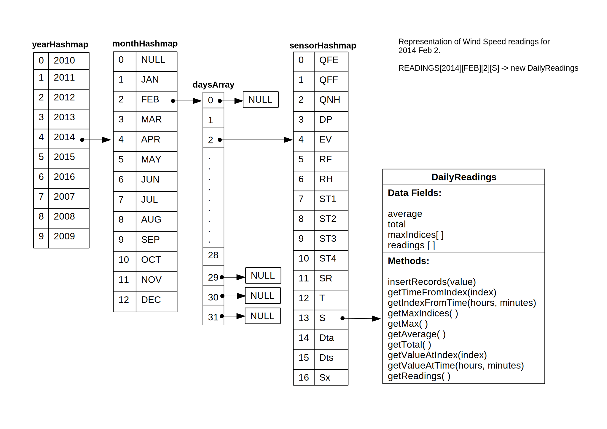

# Analysis of the problem
The goal of the exercise is to store 10 years worth of 5 min interval sensor readings in such a way that lookups can be done efficiently. One main charactersitic of the given data is that the storage requirements are constant. ie we know that the data is for 10 years and every year has 12 months. The number of days in every month is known and so is the total number of readings per sensor per day (One reading per 5 mins - 288 readings per sensor per day).  
A common requirement in the problem set is the ability to get the value, given a sensor type and date (year, month and/or day). It one of the questions also asks for the exact time stamp of the reading.  
Values like maximum, average and total can be calculated along with inserts to avoid redundant linear parsing of sensor readings, hence the proposed data structure should support this. While searching or sorting the readings, we also need to consider the fact that there could be duplicates and have to choose search and sort algorithms that can handle duplicates. Some cases we might also need to come up with custom algorithms, for example to find max values and their time stamps, including duplicates.

# Proposed Data Structures
Since the keys of the input data (Year, Month, Day, Sensor Type) are pre-known and definite, one of the best options to store the data is hashmaps. Hashmaps lets us do the lookups with constant time complexity, ie O(1). 
For example to get the object of class data structure for Wind Speeds on 2nd February 2014 a single lookup over the hashmaps fetches the required daily reading data structure.  

READINGS[2014][FEB][2][S] -> Object of DailyReadings  

The below diagram shows a visualization of the above call with all the data structures included.


**Implementation details of the hashmaps and other data structures are explained below.**
## Year Hashmap
Data for a year is stored in the *yearHashmap*. Since the data set is smaller (10 entries), a simple modular hashing function with a linear collision resolution can be used on an array of 10 elements.
```
h(k) = k mod m
```
where k = year and m = 10.  
###### Example Hashmap table
| Key | Index |
|-----|:-----:|
|2007 |7
|2008 |8
|2009 |9
|2010 |0
|2011 |1
|2012 |2
|2013 |3
|2014 |4
|2015 |5
|2016 |6

**Element of yearHashmap is an object of monthHashmap.**
```
yearHashmap[2014] -> monthHashmap[]
```
## Month Hashmap
The *monthHashmap* uses a custom hashing function which accepts the 3 letter string representation of month name and output the numeric value of the month. The output of this hashing function is always unique, hence there is no need for a collision resolution function. The size of the array used by this hashmap is 13 and index 0 is pointed to NULL. So that the actual values begins from 1 and goes upto 12.
```
h(JAN) = 1
h(FEB) = 2
h(MAR) = 3
h(APR) = 4
h(MAY) = 5
h(JUN) = 6
h(JUL) = 7
h(AUG) = 8
h(SEP) = 9
h(OCT) = 10
h(NOV) = 11
h(DEC) = 12
```
###### Example Hashmap table
| Key | Index |
|-----|:-----:|
|JAN |1
|FEB |2
|MAR |3
|APR |4
|MAY |5
|JUN |6
|JUL |7
|AUG |8
|SEP |9
|OCT |10
|NOV |11
|DEC |12

**Element of monthHashmap is a daysArray.**
```
monthHashmap[FEB] -> daysArray[]
```
## Days Array  
The *daysArray* is an array of *sensorHashmap* values. Use of hashmap here will be reduntand and the day number can be used as the index of the array without passing it through a hashing function. The size of the array is 32 indexed (0..31) with all values initialized to NULL. 
```  
daysArray = [NULL, NULL,...., NULL]
```
Initializing the array elements to NULL helps in handling the varying number of days across months. For example if the daysArray[31] is pointing to NULL, we can safely assume that the month has only 30 days. However while looping through the daysArray, we need to keep a separate counter variable to get the actual number of days at the end.
```
SET counter = 0
FOR index IN 1 TO 31:
  IF daysArray[index] NOT NULL:
    SET counter = counter + 1
  ENDIF
ENDFOR
```
**Element of daysArray is a sensorHashmap.**
## Sensor
The *sensorHashmap* uses a custom hashing function as well. It takes the sensor type as an input and returns the index.
```  
h(QFE) = 0
h(QFF) = 1
h(QNH) = 2
h(DP) = 3
h(EV) = 4
h(RF) = 5
h(RH) = 6
h(ST1) = 7
h(ST2) = 8
h(ST3) = 9
h(ST4) = 10
h(SR) = 11
h(T) = 12
h(S) = 13
h(Dta) = 14
h(Dts) = 15
h(Sx) = 16
```
###### Example Hashmap Table
| Key | Index |
|-----|:-----:|
|QFE |0
|QFF |1
|QNH |2
|DP  |3
|EV  |4
|RF  |5
|RH  |6
|ST1 |7
|ST2 |8
|ST3 |9
|ST4 |10
|SR  |11
|T   |12
|S   |13
|Dta |14
|Dts |15
|Sx  |16

**Element of a sensorHashmap is an object of DailyReadings class**
## Daily readings
The goal in the design of data set for daily readings is to do the following actions efficiently:  
1) Insert new item
2) Find the max value(s) including duplicates along with the timestamp
3) Find average value
4) Find total

We need to use a class data structure to fullfill all these requirements.  
Daily sensor readings are inserted to an array data field in this class. Max value(s), average and total can be calculated or updated along with insert. Average and total are also stored as data fields. However we need some special considerations for storing the max values.  

It is a requirement that we not only need the maximum values but also the time associated with the values. We know that readings are taken every 5 mins and that makes total 288 readings per day. If we get the values sorted by time and store these values in an array of size 289 (ie index 0 - 288) starting from index 1, the nth item will be the reading at (n * 5)th minute.  
In short given an index n, we can find the time as below.
```
totalMinutes = n * 5  
hours = INTEGER(totalMinutes / 60)  
minutes = INTEGER(totalMinutes mod 60)  
```
For example:  
readings[15] is the reading at 75th minute or in other words, the time will be 01:15 (24 hr format).  

The calculation can be reversed to find the reading for a specific time as follows.
```
totalMinutes = (hours * 60) + minutes
n = totalMinutes / 5
value = readings[n]
```
Since we can easily find the value and time from the index of the item in the sensor readings array, the max values can be represented as an array of their indices in the senso readings array.  

A class data structure of the following blue print can be used to store the daily readings.  
#### Data fields 
- Array of values
- Array of indices of max values
- Average
- Total
#### Methods
- Insert new reading
- Return array of readings
- Return max values array
- Return max value
- Return total
- Return average
- Return time given an index
- Return index given a time
#### Pseudo Code:  
```
CLASS DailyReadings():
  SET maxIndices = []  
  SET average = 0.0
  SET total = 0.0
  SET readings = []

  FUNCTION insertRecord(value):
    PUSH value TO readings[]
    SET lastIndex = (length of readings[]) - 1 

    IF (length of maxIndices[]) > 0:
      SET currentMax = readings[maxIndices[0]]  // Get the value at current max index

      IF readings[lastIndex] > currentMax:
        SET maxIndices = [lastIndex]          // Re-initialize the maxIndices array with lastIndex as the only member
      ELSEIF readings[lastIndex] == currentMax:
        PUSH lastIndex TO maxIndices[]   // Push lastIndex to maxIndices array if value is equal to the max value (duplicate)
      ENDIF

    ELSE:
      PUSH lastIndex TO maxIndices       // If max indices array is empty add this one.
    ENDIF

    SET total = total + value
    SET average = total / (length of readings[])
  ENDFUNCTION

  FUNCTION getTimeFromIndex(index):
    //Assuming that time is the string representation of HH:MM in 24 hours format
    
    SET totalMinutes = index * 5
    SET hour = INTEGER(totalMinutes / 60)
    SET minutes = INTEGER(totalMinutes % 60)

    RETURN hour + ":" + minutes
  ENDFUNCTION

  FUNCTION getIndexFromTime(hours, minutes):
    SET totalMinutes = (hours * 60) + minutes
    SET index = totalMinutes / 5
    RETURN index
  ENDFUNCTION

  FUNCTION getMaxIndices():
    RETURN maxIndices
  ENDFUNCTION

  FUNCTION getMax():
    //Return the numeric max value (no duplicates)
    IF (length of maxIndices) > 0:
      RETURN readings[maxIndices[0]]
    ELSE:
      RETURN NULL
    ENDIF

  FUNCTION getAverage():
    RETURN average
  ENDFUNCTION

  FUNCTION getTotal():
    RETURN total
  ENDFUNCTION

  FUNCTION getValueAtIndex(index):
    RETURN readings[index]
  ENDFUNCTION

  FUNCTION getValueAtTime(hours, minutes):
    SET index = getIndexFromTime(hours, minutes)
    RETURN getValueAtIndex(index)
  ENDFUNCTION

  FUNCTION getReadings():
    RETURN readings[]
  ENDFUNCTION

ENDCLASS
```
# Algorithms
## 1. The maximum wind speed of a specified month and year.
Input: Integer year, String month  
Output: Integer windSpeed  

Pseudo Code:
```
FUNCTION getMaxWindSpeed(year, month):
  SET max = 0

  FOR index IN 1 TO 31:
    SET day = READINGS[year][month][index]

    IF day NOT NULL:
      SET dayMax = day[S].getMax()
      IF dayMax > max:
        SET max = dayMax
      ENDIF
    ENDIF
  ENDFOR

  RETURN max

ENDFUNCTION
```
## 2. The median wind speed of a specified year.
Input: Integer year
Output: Float median wind speed

Pseudo Code:
```
FUNCTION getMedianWindSpeed(year):
  SET windSpeedArray = []
  
  FOR m IN 1 TO 12:
    SET month = READINGS[year][m]

    FOR d IN 1 TO 31:
      SET day = month[d]

      IF day NOT NULL:
        JOIN windSpeedArray AND day[S].getAllReadings()      // getAllReadings member FUNCTION in DailyReadings class returns the array of daily readings
      ENDIF

    ENDFOR

  ENDFOR

  // Sort the windSpeedArray using QuickSort

  SET sortedWindSpeedArray = QuickSort(windSpeedArray)


  IF length of sortedWindSpeedArray is odd:
    SET pivot = (length of sortedWindSpeedArray - 1)/2
    SET median = sortedWindSpeedArray[pivot]
  ELSE:
    SET pivot = (length of sortedWindSpeedArray)/2
    SET median = (sortedWindSpeedArray[pivot - 1] + sortedWindSpeedArray[pivot]) / 2
  ENDIF

  RETURN median

ENDFUNCTION
```
## 3. Average wind speed for each month of a specified year in the order of month
Input: Integer year  
Output: Array of Integers averageWindSpeed (sorted in the order of month)  

Pseudo Code:
```
FUNCTION getAverageWindSpeed(year):
  SET averageWindSpeed = []

  FOR month IN (JAN FEB MAR APR MAY JUN JUL AUG SEP OCT NOV DEC):
    SET monthAverageTotal = 0
    SET numberOfDays = 0

    FOR index 1 TO 31:
      SET day = READINGS[year][month][index]

      IF day NOT NULL:
        SET numberOfDays = numberOfDays + 1
        SET monthAverageTotal = monthAverageTotal + day[S].getAverage() // getAverage() is a method in DailyReadings class
      ENDIF
    ENDFOR

    SET monthAverage = monthAverageTotal / numberOfDays          // average of averages == average (since weight is same; 288 readings per day)
    PUSH monthAverage TO averageWindSpeed[]
  ENDFOR

  RETURN averageWindSpeed
ENDFUNCTION
```

## 4. Total solar radiation for each month of a specified year in a descending order of the solar radiation.
Input: Integer year  
Output: Array (size 12) of Integers totalSolarRadiation (sorted descending order)  

Pseudo Code:
```
FUNCTION getTotalSolarRadiation(year):
  SET totalSolarRadiation = []

  FOR month IN (JAN FEB MAR APR MAY JUN JUL AUG SEP OCT NOV DEC):
    SET monthTotal = 0

    FOR index IN 1 TO 31:
      SET day = READINGS[year][month][index]

      IF day NOT NULL:
        SET monthTotal = monthTotal + day[SR].getTotal()     // getTotal() is a method in DailyReadings class
      ENDIF
    ENDFOR

    // Insert monthTotal into correct position in the array

    FOR index IN 0 TO 11:
      IF totalSolarRadiation[index] IS NULL:
        SET totalSolarRadiation[index] = monthTotal
        BREAKFOR
      ELSEIF monthTotal > totalSolarRadiation[index]:
        PUSH ELEMENTS FROM INDEX UPTO END ONE STEP TO THE RIGHT
        SET totalSolarRadiation[index] = monthTotal
        BREAKFOR
      ENDIF
    ENDFOR

  ENDFOR

  RETURN totalSolarRadiation
ENDFUNCTION
```
## 5. Given a date, show the times for the highest solar radiation for that date, including duplicates, displayed in reverse chronological order.
Input: Integer Year, String Month, Integer Day
Output: String representation of time as HH:MM in 24 hour format

Pseudo Code:  
```
FUNCTION getHighestSolarRadiationTimes(year, month, day):

  SET srDailyReadingsInstance = READINGS[year][month][day][SR]
  SET maxReadingsIndices = srDailyReadingsInstance.getMaxIndices()     // getMaxIndices() is a method in DailyReadings class

  FOR index IN (length of maxReadingsIndices - 1) TO 0:   // getMaxIndices() method returns the array of indexes sorted in chronological order by default.
    SET maxReadingIndex = maxReadingsIndices[index]
    SET time = srDailyReadingsInstance.getTimeFromIndex(maxReadingIndex)     // getTimeFromIndex() is a method in DailyReadings class
    PRINT time 
  ENDFOR
  
ENDFUNCTION
```
# Conclusion

## Space and time requirement
